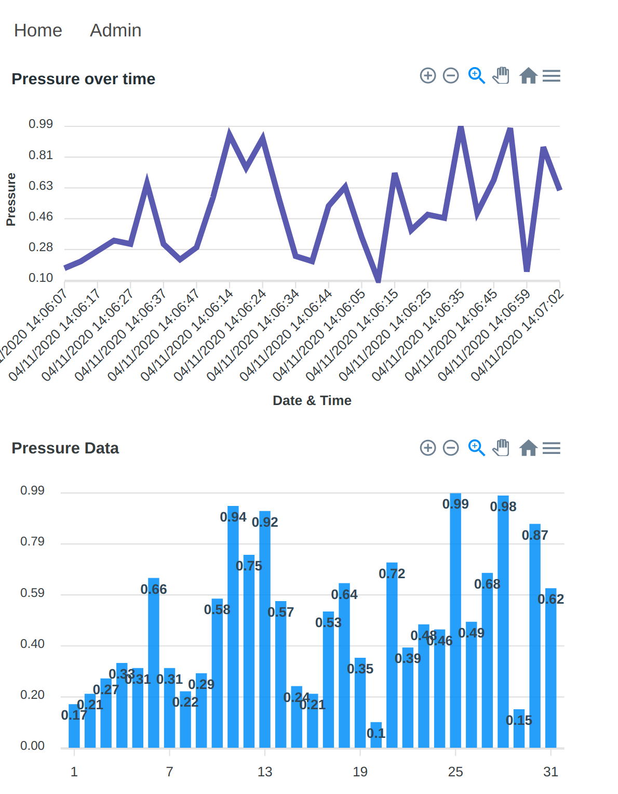
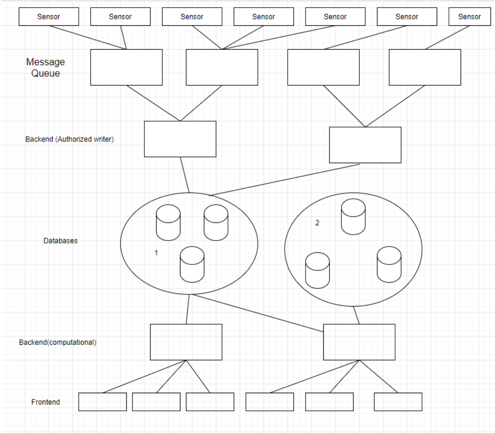

# Report
The following project was created alongside [MrConfetti](https://github.com/MrConfetti) and [ArseniyNikonov](https://github.com/ArseniyNikonov).

The following document showcases which technologies were used to create our application as well as a small section on why the application was chosen.

## Architecture
The architecture follows the following structure. Sensors of different types send data continuously through a distributed message broker. Messages are consumed by a consumer who inserts sensor data into a database. From the other end, clients connect to a frontend. From there, different requests can be made to either an authorization service, or to a data service. These services have access to the two different types of databases which both store different things namely data and clients. What is not visible in the diagram is the socket connection between the frontend clients and a backend service that consumes the same data as the broker consumers and feeds it to the frontend. Everything runs in Docker, is orchestrated by Kubernetes, load balanced by Kubernetes services, and external traffic is routed via an ingress controller. 

## Frontend
**Technologies:** HTML, CSS, Javascript, Vue.JS, Buefy, Axios, Vuex, ApexCharts, Socket.io, NGINX  
**Description:**  The `frontend` is responsible with showcasing the sensor data to the user. It exposes a user-friendly UI with which the user can interact with the `backend`, `backend-auth` and `backend-updates` services via Axios calls. The `frontend` consists of 2 pages. First, the Home page, visible to anyone accessing the site. It presents live-updated charts of the sensor measurements, created with ApexCharts. The sensor data is received as messages through Socket.io, through 3 different channels (1 for each sensor type) and stored in the Vuex store, to be retrieved by the chart components. This way, there is a single source of truth the charts are observing and displaying. The second page, Admin, is only accessible to authorized users. The `frontend` provides the user the means to register (create) and account and log-in to an existing account, in order to access the Admin page.
**Pros/Cons:** The advantage of choosing Vue.JS as our framework instead of React.JS or Angular.JS was that two of the teammembers were already familiar with the framework and it is generally considered the easiest to learn, which was important for the third member of the team. The disadvantage with our technology choice is that it is mostly written in JavaScript, which often yielded unexpected results, which amounted to longer development times.

## Backend
**Technologies**: NodeJS, Express.

**Description**: The `backend` service serves all `frontend` requests that pertain to retrieving historical data. It contains a driver for Cassandra, a router for serving all possible routes, as well as a debug route for posting its status.

**Pros**: The advantages of using NodeJS and Express is that it allows for asynchronous messaging implemented via `async await` statements and `promises`. Since NodeJS is single-threaded, NodeJS uses the event loop meaning that calls that return after a delay (typically calls to other webservers or queries to databases) get executed as they return. The asynchronous nature of NodeJS (if done right) allows the server to be non-blocking and to cope with multiple requests by resolving them as they are done and not waiting for each one to finish before processing the next.

**Cons**: The disadvantage of using NodeJS is that it uses Javascript which is not a typed programming language. This can yield some unexpected behaviour if API contracts are not well-established or if the user makes a small programming mistake. Javascript will not complain and you run into surprises like "1" + 1 = "2" vs 1 + "1" = 11. The obvious solution to this is to use Typescript, something which we had considered, but ended up dropping due to the overhead of having to learn it.

## Backend-auth
**Technologies**: NodeJS, Express, JWT, bcrypt, mongoose.

**Description**: The `backend-auth` services handles authorization contains protected routes via JWT verification. The service is broken down into two main parts: authorization and mongodb interfacing. Authorization is done by receiving a validated request by the `frontend` containing client information such as the email and password. First, the email is checked in case it already is present in `mongodb`. If not, the password is hashed, salted, and signed with a secret that's stored in a hidden config file. The user is inserted into `mongodb` and, whenever a login request gets submitted, the password sent through the request gets through the same process to be checked against the one in the database. If they match, then the user receives a authorization header containing the token which is stored on local storage on the client side. Before inserting data into the mongodb database, it is first validated with a schema we created with mongoose. This way we make sure all the data present in the database adheres to a certain format.

**Pros/Cons**: The same advantages and disadvantages stated for the `backend` service apply here.

## Consumerdb
**Technologies:** NodeJS, Express, Kafkajs.
**Description:** The consumer consumers the `sensor_data` kafka topic and inserts all incoming sensor data into Cassandra.
**Pros/Cons:**  The same pros and cons hold as in `backend`.

## Backend-updates
**Technologies**: NodeJS, Express, Socket.io, Kafkajs.

**Description**: `backend-updates` is a kafka consumer that consumes sensor data sent to a `sensor_data` topic. It is part of a `live_updates` consumer as to not be load-balanced with historical consumers that are part of the `sensor_data` group.  Data is streamed via a socket.io websocket to the frontend. To ensure that the websocket protocol is used, the client sets the transport protocol to `websocket` and the `backend-updates` service stores every incoming connection into a `connections` array. Then, when the service consumes an incoming sensor input, `backend-updates` loops through every connection and emits to the sensors' corresponding stream.

**Pros/Cons**: The same advantages and disadvantages stated for the `backend` service apply here. Socket.io has its own section.

## Message broker
**Technologies**: Kafka.

**Description**: Kafka is used as the message broker between consumers and producers. Consumers are the `consumerdb` service and the `backend-updates` service. Producers are all `sensors` services.  Kafka is deployed using a Kubernetes `Deployment` object which is stored in memory. It is set up to pass `ADVERTISED_LISTENERS` equal to the IP address of the pods in which the brokers are living as metadata once a new consumer/producer connection to the cluster is made. State information is maintained via Zookeeper.

**Pros**: Sensor information is passed through Kafka. Because Kafka ensures that messages that reach it will leave in the order in which they came, up to date and accurate information regarding sensor values can be seen on the `frontend`. Moreover, Kafka stores data locally in case `consumer` nodes break down for a pre-defined duration of seven days making it fault-tolerant to `backend` crashes that disrupt the stream. On top of everything, kafka can be distributed onto multiple machines, making it a scalable solution to message passing.

**Cons**: As a process, Kafka is resource expensive during spikes. It also takes time to understand its inner workings in order to set up properly within Kubernetes.

## Zookeeper
**Technologies:** Zookeeper
Zookeeper is used in combination with Kafka in order to maintain state information of a Kafka node should a failure occur. Additionally, it coordinates Kafka brokers as every Kafka broker registers to Zookeeper and heartbeats their information to it. Information is stored within `etcd` and, in case of error, the order of events that are stored within `etcd` are taken to reach the original state before the error was thrown. 

## Data Database
**Technologies:** CassandraDB
**Description:** Cassandra is a key-value storage service that is deployed in a replicated manner and serves to store all historical sensor data.
**Pros/Cons:** It is very fast and also is the optimal use case for our type of data as sensor data is essentially key:value, namely timestamp:value. Its speed derives from the data stracture that is used, which is SSTables. Alongside consistent hashing, Cassandra allows client requests to be distributed along its partitions. However, due to its replication scheme, looping over nodes within the replication scheme is costly.

## Clients Database
**Technologies:** MongoDB
**Description:** A replicated instance of mongo is used to store clients in a clients collection.
**Pros/Cons:** MongoDB was chosen due to its short development time that's facilitated by its document-oriented ideology. Disadvantages to mongo include considerations with respect to how to link documents together. 

## Containerization (Docker)
**Technologies:** Docker, docker-compose.
**Description:** We separately containerized each of the main services described in this document, using Docker. Then, by configuring an appropriate docker-compose file, we were able to start our entire infrastructure with a single line of code. This not only made the development process faster, but also more flexible, as by just commenting some lines in the docker-compose file, we could choose exactly what containers to start, depending on the development needs at that time. Furthermore, it also made testing the scaling of the application much easier, as with a single flag we could decide how many containers of the same image to start.
**Pros/Cons:** Working with Docker made it very easy to keep the project consistent across our machines and removed the pain of having to debug environment issues. Thus we feel like Docker helped a lot with the development process as a whole and we enjoyed using it. If we were to find a con, it would be the performance problems on non-native environments. One of our teammates who was using Docker in Mac OS had significant performance deficits when starting a complex infrastructure. 

## Orchestration
**Technologies:** Kubernetes
**Description:** In order to scale the application on multiple machines the Kubernetes orchestration engine was used. It uses the following abstractions: Deployments, Services, StatefulSets, Ingress. All stateless applications are deployed via he `Deployment` object whilst all stateful applications are deployed via `StatefulSets`. Stateful applications are: All databases, Zookeeper.
**Pros/Cons:** Kubernetes, even when deployed locally, gives us more fault-tolerancy and scalability than Docker because scaling the application is easier and load-balancing comes free with the `Service` object. It also offers the possibility of integrating an `Ingress` to route external traffic to different services. We have done this to route traffic coming from the local browser that lives outside the K8s network to different services. `Ingress` can also be configured using `configmaps` or `annotations` to set cookies which are crucial in maintaining socket sessions between load balanced services. Alternatives to Kubernetes include: Nomad and Docker Swarm.

## Load-balancer
**Technologies:** NGINX-ingress / NGINX
**Description:** Outside of Kubernetes, an NGINX server is used as a proxy to a number of different services set up in an `upstream` configuration that allows round-robin load balancing.
**Pros/Cons:**

## Socket
**Technologies:** Socket.io
**Description:** A client websocket setup on the frontend to receive sensor data from a socket.io backend service that consumes `sensor_data` topic in the `live_updates` group. The socket is set to use the `websocket` protocol and not the HTTP long polling version since that would defeat the purpose of having it in the first place (not really, but it's close). A session cookie is stored on the client-side in order to maintain the connection. Three different socket streams are used, each one pertaining to a different kind of sensor.
**Pros/Cons:** Very small overhead when it comes to streaming data continuously to the frontend. Provides a minimalist API that is easy to work with. On the other hand, documentation needs to be scraped in order to learn about how certain mechanisms are implemented.

## Sensors
**Technologies:** Python
**Description:** A set of sensors that produce different values ({temperature, pressure}, {leakage}, {quality}) was created using Python. These sensors produce different values at different time intervals.
**Pros/Cons:** Developing sensors in python provides a very minimalist setup which enables us to change the types of sensors and swapping different ones easily. Scaling sensors is also easy in Docker since the images container footprint is fairly small.
